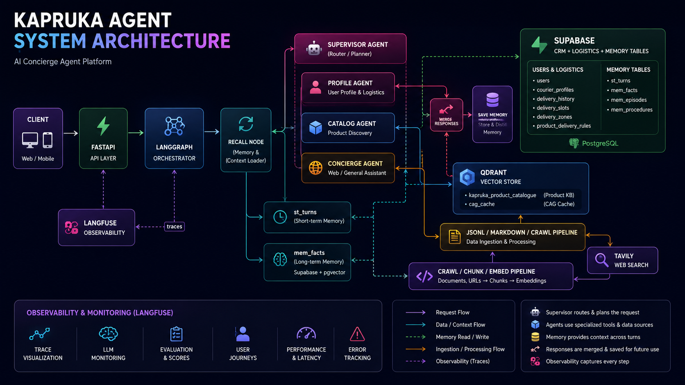
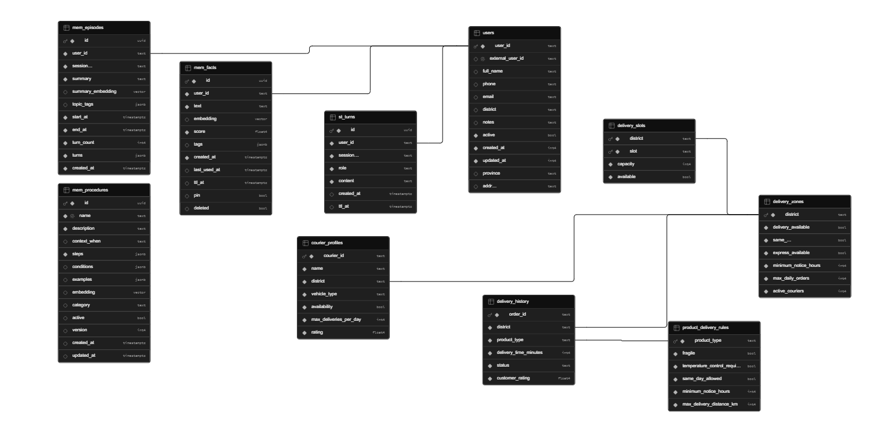

# Kapruka Agent

Stateful multi-agent gift concierge for the Kapruka domain, built to showcase context engineering, retrieval engineering, orchestration, and production-style AI system design.

This repository is not a single-prompt demo. It combines:

- LangGraph state orchestration
- structured routing and multi-route fan-out
- short-term and long-term memory
- RAG, CAG, and CRAG
- relational CRM and logistics reasoning
- Qdrant vector retrieval
- Supabase + pgvector memory storage
- FastAPI serving
- Langfuse tracing and prompt management

The core idea is simple: keep deterministic business data in SQL, keep fuzzy semantic knowledge in vector stores, and make the control flow explicit enough to inspect, test, and extend.

## What This Project Demonstrates

### Context engineering

- `memory_context` is built from recent conversation turns before routing or synthesis.
- `semantic_facts` carries structured long-term memory facts into the graph as `list[dict]`, not as one flattened string.
- specialist agents receive different prompt frames and different tool outputs.
- compound requests are decomposed into multiple routes, executed in parallel, then merged into one user-facing answer.
- prompt templates are externalized through Langfuse prompt management with local fallbacks in code.

### Retrieval engineering

- product knowledge retrieval is separated from CRM/logistics retrieval.
- Qdrant is used for the Kapruka product corpus and for the semantic CAG cache.
- parent-child chunking is the current default ingestion strategy.
- CRAG expands retrieval only when confidence is low.
- a dedicated semantic cache short-circuits repeated and paraphrased questions.

### Systems engineering

- FastAPI lifespan builds the agent once at startup.
- async endpoints use `ainvoke()` / `astream()` so the event loop stays non-blocking.
- state transitions are explicit in a LangGraph `StateGraph`.
- traces, token usage, latency, and prompt versions are observable through Langfuse.
- storage is externalized: Supabase for memory and CRM, Qdrant for vectors, Tavily for time-sensitive web search.

### Product and domain engineering

- the repo models real Kapruka concerns: catalog retrieval, delivery feasibility, courier availability, slot capacity, product delivery rules, and customer memory.
- structured logistics data is normalized instead of buried inside prompts.
- the router includes post-processing heuristics to recover common delivery/logistics misroutes.

## Architecture



## LangGraph Workflow

The orchestrator in `src/agents/orchestrator.py` compiles this graph:

1. `recall`
   Loads short-term turns from `st_turns` and long-term facts from `mem_facts`.
2. `supervisor`
   Calls the LLM router, serializes route decisions into graph state, and decides whether to fan out.
3. `profile_agent`
   Handles CRM and logistics requests through `CRMTool`.
4. `catalog_agent`
   Handles product/catalog/internal FAQ retrieval through `RAGTool`.
5. `concierge_agent`
   Handles direct concierge turns and web search turns.
6. `merge_responses`
   Merges parallel specialist outputs when the router emitted multiple routes.
7. `save_memory`
   Stores the conversation pair in short-term memory and optionally distills durable facts into long-term memory.

### Route map

| Route | Node | Purpose |
| --- | --- | --- |
| `crm` | `profile_agent` | customer profile lookups and structured logistics checks |
| `rag` | `catalog_agent` | Kapruka product retrieval, recommendations, internal FAQ |
| `web_search` | `concierge_agent` | live external information such as weather or disruptions |
| `direct` | `concierge_agent` | greetings, memory-only turns, general concierge replies |

### State design

The shared `AgentState` in `src/agents/state.py` is a meaningful part of the system design:

- `messages`
  LangGraph message list with `add_messages` reducer.
- `user_id`, `session_id`
  stable identifiers passed through every node.
- `memory_context`
  formatted short-term context.
- `semantic_facts`
  structured long-term facts for specialist prompts.
- `route_decision`, `route_decisions`
  backward-compatible single route plus full multi-route list.
- `tool_output`, `final_answer`
  raw tool output and synthesized answer.
- `agent_outputs`
  reducer-backed collector used to merge parallel branch outputs.
- `should_distill`
  write-path signal from the memory node.

That state model is what turns the graph from "tool calling" into explicit context engineering.

## Router Design

The router in `src/agents/router.py` does more than intent classification.

### What it does

- asks the LLM for strict JSON output
- supports up to 3 routes for one user message
- validates routes and CRM actions
- deduplicates repeated routes
- extracts parameters for CRM/RAG/web actions
- repairs common delivery-feasibility misroutes after parsing

### Why that matters

Real user messages are often compound:

- "Find a birthday cake under Rs. 5000 and check if same-day delivery is available in Kandy."
- "Update my phone number and recommend chocolates."

Instead of forcing one brittle prompt to solve everything, the router emits structured work items and the graph fans out.

### Logistics rerouting heuristic

One of the more practical engineering decisions in this repo is the router post-processor:

- delivery-feasibility questions that an LLM may label as `web_search` or `direct` are corrected toward CRM/logistics actions when the query looks like a structured district/slot/product coverage request.
- live disruption queries still stay on the web-search path.

The regression tests in `tests/test_logistics_flow.py` exist specifically to protect that behavior.

## Memory System

The memory subsystem lives in `src/memory/`.

### What is actively used on the main chat path

#### Short-term memory

- store: `st_turns`
- implementation: `src/memory/st_store.py`
- backend: Supabase PostgreSQL
- behavior:
  - TTL-backed conversation storage
  - ring-buffer trimming
  - session-scoped recent-turn recall
- current defaults from `src/infrastructure/config.py`:
  - max turns: `30`
  - TTL: `24h`

#### Long-term semantic memory

- store: `mem_facts`
- implementation: `src/memory/lt_store.py`
- backend: Supabase PostgreSQL + pgvector
- behavior:
  - semantic retrieval by embedding similarity
  - score decay
  - soft deletion
  - cross-run semantic deduplication
- current defaults:
  - top-k: `5`
  - similarity threshold: `0.30`
  - TTL horizon: `90 days`
  - half-life: `30 days`
  - cross-run dedup similarity: `0.92`

### Distillation path

`src/memory/memory_ops.py` contains:

- `MemoryDistiller`
  - triggers when the conversation is long enough or contains memory-like phrases such as `remember`, `always`, or `never`
  - uses an LLM to extract durable facts
  - scores facts
  - deduplicates within-batch
  - upserts to long-term memory
- `MemoryRecaller`
  - retrieves ST + LT memory
  - applies a token budget
  - currently uses a 60/40 short-term vs long-term budget split within a 500-token recall window

### Additional memory layers present in the repo

These exist and are implemented, but they are not on the default orchestration path today:

- `mem_episodes`
  - `src/memory/episodic_store.py`
  - stores summarized conversation episodes with pgvector summaries.
- `mem_procedures`
  - `src/memory/procedural_store.py`
  - stores semantically searchable workflows and procedures.

That distinction matters: the repo contains a broader memory architecture than the current default agent runtime actively consumes.

## Retrieval Stack

The retrieval path is implemented in `src/services/chat_service/` and `src/agents/tools/rag_tool.py`.

### RAG

`RAGTool` is the public tool used by the agent for product, catalog, and internal FAQ retrieval.

Under the hood:

1. embed the query
2. search Qdrant
3. retrieve parent-child-aware context
4. build a grounded prompt
5. synthesize an answer

The retriever in `src/services/chat_service/rag_service.py`:

- is a LangChain-compatible `BaseRetriever`
- deduplicates by `parent_id`
- passes `parent_text` as the LLM-facing `page_content`
- preserves child text and metadata in the payload

### CAG

`CAGCache` in `src/services/chat_service/cag_cache.py` is a semantic cache backed by a dedicated Qdrant collection.

Current behavior:

- collection: `cag_cache`
- threshold: `0.90`
- TTL: `24h`
- lookup: KNN-1 over query embeddings
- duplicate cleanup on set: near-identical entries above `0.99`

Why this is useful:

- repeated questions return instantly
- paraphrases can still hit the cache
- cached answers do not pollute the product corpus because the cache lives in its own collection

### CRAG

`CRAGService` in `src/services/chat_service/crag_service.py` adds a corrective retrieval pass.

Current flow:

1. initial retrieval with `k=4`
2. confidence scoring
3. if confidence `< 0.6`, expand retrieval to `k=8`
4. generate from the better evidence set

Confidence is currently heuristic-based in `src/infrastructure/utils.py`:

- keyword overlap
- content richness
- strategy diversity

### End-to-end CAG -> CRAG pipeline

The agent-facing `RAGTool` uses:

`query -> semantic cache -> cache miss -> CRAG -> answer -> cache set`

That gives the system two operating modes:

- low-latency path for repeated/common questions
- higher-quality corrective path for uncertain retrieval

## Ingestion and Knowledge-Base Engineering

The ingestion pipeline lives in `src/services/ingest_services/`.

### Sources

The repo currently contains two product corpora derived from the Kapruka crawl:

- `data/kapruka_docs.jsonl`
  - structured product records
- `data/kapruka_markdown/`
  - rendered markdown product pages

The current CLI-exposed ingestion source is `jsonl`, via `scripts/ingest_to_qdrant.py`.

### Chunking strategies implemented

`src/services/ingest_services/chunkers.py` implements:

- `semantic_chunk`
- `fixed_chunk`
- `sliding_chunk`
- `parent_child_chunk`
- `late_chunk_index`
- `late_chunk_split`

### Current default

The actual current ingestion CLI default is:

- source: `jsonl`
- strategy: `parent_child`

Relevant config values:

- parent size: `1200`
- child size: `250`
- child overlap: `50`
- retrieval top-k: `4`
- retrieval similarity threshold: `0.7`

### Why parent-child is a good fit here

The Kapruka dataset is product-centric and fairly compact. Parent-child chunking works well because:

- child chunks improve retrieval precision
- parent text gives the generator richer context
- repeated field structures such as price, partner, options, and descriptions stay connected during synthesis

### Crawler

`src/services/ingest_services/web_crawler.py` contains an async Playwright crawler that:

- prioritizes product detail pages
- extracts product metadata and option values
- converts crawled HTML into structured content
- keeps discovery order stable
- enforces max-depth, max-pages, and max-saved-docs limits

The notebooks show the crawl process that produced the current dataset snapshot.

## Database Schema



The database schema covers both the memory system and the operational CRM/logistics model:

- conversation memory in `st_turns`
- semantic memory in `mem_facts`
- episodic memory in `mem_episodes`
- procedural memory in `mem_procedures`
- customer identity in `users`
- delivery planning in `delivery_zones`, `delivery_slots`, and `courier_profiles`
- product constraints in `product_delivery_rules`
- historical fulfillment signals in `delivery_history`

## CRM and Logistics Layer

The structured business-data path is intentionally relational.

### Tables

The schema generator and SQL snapshot define:

- `users`
- `delivery_zones`
- `delivery_slots`
- `courier_profiles`
- `product_delivery_rules`
- `delivery_history`
- plus memory tables:
  - `st_turns`
  - `mem_facts`
  - `mem_episodes`
  - `mem_procedures`

### Current structured seed data

From `data/logistics/`:

- `25` delivery zones
- `125` delivery slots
- `1000` courier profiles
- `10` product delivery rule rows
- `10000` delivery history rows

### Why this matters

Delivery coverage, courier capacity, slot availability, and product constraints are deterministic business queries. They should not be hallucinated from text retrieval.

That is why the CRM/logistics tool path exists separately from product RAG.

### CRM tool actions

`src/agents/tools/crm_tool.py` supports:

- `lookup_user`
- `create_user`
- `update_user`
- `deactivate_user`
- `list_users`
- `get_delivery_zone`
- `list_delivery_slots`
- `search_couriers`
- `get_product_delivery_rule`
- `lookup_delivery_history`
- `check_delivery_coverage`

`check_delivery_coverage` is especially important because it synthesizes:

- district-level availability
- same-day feasibility
- slot availability
- product delivery rules
- top available couriers
- historical delivery summary

## Prompt and Observability Layer

The observability and prompt-ops design lives in:

- `src/infrastructure/observability.py`
- `src/agents/prompts/agent_prompts.py`
- `src/memory/prompts.py`

### Langfuse usage

Langfuse is used for:

- tracing graph nodes
- tracking token usage and latency
- routing and memory-generation visibility
- prompt management with live override capability

### Prompt management pattern

Prompts are fetched from Langfuse by name, but every prompt has a local fallback in code.

That gives you:

- editable prompts in Langfuse without code redeploy
- safe local execution when Langfuse prompts do not exist yet
- versionable agent behavior across router, synthesis, memory distillation, and specialist prompts

### Observed units

Key traced units include:

- router invocation
- recall node
- CRM dispatch
- RAG search
- CAG generation
- web search
- memory distillation
- top-level chat request

## API Surface

The FastAPI app lives in `src/api/`.

### Routes

- `POST /chat`
  Synchronous final-answer endpoint.
- `POST /chat/stream`
  SSE stream of node-by-node progress using LangGraph `astream()`.
- `GET /health`
  Reports agent readiness and tool availability.
- `GET /graph`
  Returns Mermaid and structured edge metadata for the compiled graph.
- `GET /memory/{user_id}`
  Returns stored long-term facts for a user.
- `POST /memory/clear`
  Clears short-term memory for a session.

### API engineering details

- typed request/response schemas live in `src/api/schemas.py`
- startup builds the agent once in FastAPI lifespan
- blocking startup work is moved to `asyncio.to_thread`
- CORS is open for experimentation
- streaming summarizes per-node state instead of dumping raw graph internals

## Repository Map

### Top-level

- `pyproject.toml`
  package metadata and Hatch configuration.
- `requirements.txt`
  broader runtime and notebook dependency list.
- `Makefile`
  workflow shortcuts for install, schema init, seeding, ingestion, status, and tests.
- `assets/kapruka_system_architecture.png`
  system architecture diagram.
- `assets/supabase_schema.png`
  Supabase schema reference.

### Config

- `config/param.yaml`
  retrieval, chunking, cache, crawling, and path defaults.
- `config/models.yaml`
  provider/model catalog.
- `config/faqs.yaml`
  curated FAQ query/answer pairs used to warm the semantic cache.

### Data

- `data/kapruka_docs.jsonl`
  structured product corpus for ingestion.
- `data/kapruka_markdown/*.md`
  markdown-rendered crawl output.
- `data/logistics/*.json`
  structured logistics seed data.

### Source

- `src/agents/`
  router, state, orchestrator, prompts, tools.
- `src/api/`
  FastAPI app and schemas.
- `src/infrastructure/`
  config, logging, utils, observability, LLM providers, DB clients.
- `src/memory/`
  ST/LT/episodic/procedural memory implementations and policies.
- `src/services/chat_service/`
  RAG, CAG, CRAG, cache, and prompt templates.
- `src/services/ingest_services/`
  crawler, chunkers, ingestion pipeline.
- `src/services/crm_service/`
  CRM DB client and synthetic data generation.

### Scripts

- `scripts/init_supabase.py`
  initialize Supabase schema.
- `scripts/test_supabase.py`
  verify connection and pgvector extension.
- `scripts/seed_crm_unified.py`
  seed CRM users plus logistics reference data.
- `scripts/ingest_to_qdrant.py`
  ingest the product corpus into Qdrant.
- `scripts/rebuild_cag_cache.py`
  clear and warm the semantic FAQ cache from `config/faqs.yaml`.

### SQL

- `sql/supabase_schema.sql`
  SQL schema snapshot.
- `src/infrastructure/db/supabase_schema.py`
  dynamic schema generator used by setup scripts.
- `sql/01_users.sql`
  deterministic user seed data.
- `sql/02_delivery_zones.sql` through `sql/06_delivery_history.sql`
  logistics seed snapshots.

### Notebooks

- `notebooks/01_crawl_kapruka.ipynb`
  crawler workflow and crawl export.
- `notebooks/02_find_chunk_size.ipynb`
  chunk-size analysis over the product corpus.
- `notebooks/03_routing_memory_and_tools.ipynb`
  routing, memory, and tool-path walkthrough.
- `notebooks/04_multi_agent_langgraph.ipynb`
  LangGraph visualization and multi-agent demos.

### Tests

- `tests/test_logistics_flow.py`
  verifies logistics rerouting, CRM feasibility formatting, and end-to-end orchestrator behavior.

## Data and Cache Metrics

Current repository snapshot:

- `96` JSONL product records
- `96` markdown product documents
- `40` curated FAQ cache entries
- `25` delivery zones
- `125` delivery slots
- `1000` courier profiles
- `10` product delivery rules
- `10000` delivery-history rows

## Quick Start

### 1. Install dependencies

```bash
pip install -r requirements.txt
```

### 2. Configure environment

Create a `.env` with the keys your chosen runtime path needs.

Common keys used by this repo:

- `OPENAI_API_KEY`
- `QDRANT_URL`
- `QDRANT_API_KEY`
- `SUPABASE_DB_URL`
- `SUPABASE_URL`
- `SUPABASE_KEY`
- `TAVILY_API_KEY`
- `LANGFUSE_SECRET_KEY`
- `LANGFUSE_PUBLIC_KEY`
- `LANGFUSE_BASE_URL`

### 3. Initialize Supabase schema

```bash
python scripts/init_supabase.py
python scripts/test_supabase.py
```

### 4. Seed CRM and logistics data

```bash
python scripts/seed_crm_unified.py --mode template --storage database --n-users 20 --tz Asia/Colombo --rand-seed 42
```

Use `--mode llm` if you want LLM-generated CRM users instead of deterministic templates.

### 5. Ingest the product corpus into Qdrant

```bash
python scripts/ingest_to_qdrant.py --source jsonl --strategy parent_child
```

### 6. Warm the semantic FAQ cache

```bash
python scripts/rebuild_cag_cache.py
```

### 7. Run the API

```bash
python src/api/run.py
```

Docs:

- `http://localhost:8000/docs`
- `http://localhost:8000/redoc`

## Example Requests

### Product recommendation

```text
I want a birthday gift under Rs. 5000. I prefer chocolates and flowers.
```

Expected path:

- memory recall
- `rag`
- optional CAG hit or CRAG correction
- memory write-back

### Structured logistics check

```text
Can you check same-day delivery availability in Kandy for a cake?
```

Expected path:

- router may infer or repair this to `crm/check_delivery_coverage`
- CRM tool composes coverage + rule + slot + history summary

### Compound query

```text
Recommend a chocolate gift and also tell me if Kandy has an available delivery slot.
```

Expected path:

- router emits `rag` and `crm`
- LangGraph fans out
- `merge_responses` synthesizes one answer

## Running Tests

```bash
pytest tests/test_logistics_flow.py -v
```

<!-- ## Honest Snapshot Notes

This README is intentionally aligned to the current tree, not to an aspirational architecture.

- The repo contains loader helpers for markdown and KB ingestion, but the current ingestion CLI exposes `jsonl` as the active source.
- Episodic and procedural memory are implemented in the repository, but the default chat path currently uses short-term memory plus long-term semantic facts.
- `config/models.yaml` contains multi-provider catalogs, but `src/infrastructure/config.py` currently pins runtime role defaults to the OpenAI path.
- The Makefile captures the intended workflow, but some targets reference helpers that are not present in this snapshot or assume a POSIX-style shell. The direct `python ...` commands above are the reliable path. -->

## Context Engineering Architecture

The project does not treat "context" as one big prompt field.

It treats context as a composed system:

- conversational context with TTL and trimming
- persistent user facts with semantic recall
- structured business context from CRM/logistics tables
- retrieved product context from Qdrant
- cached answer context from CAG
- route context for branch execution
- merged multi-agent context for final synthesis
- prompt context controlled through Langfuse

That is the real engineering value in this codebase: context is modeled, stored, routed, budgeted, traced, and tested.
