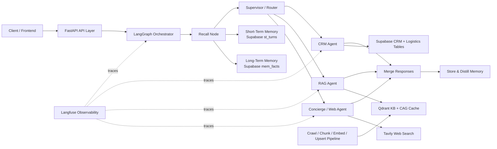

# Kapruka Agent | Stateful Multi-Agent Gift Concierge

[](https://www.python.org/)
[](https://fastapi.tiangolo.com/)
[](https://www.langchain.com/langgraph)
[](https://qdrant.tech/)
[](https://supabase.com/)
[](#license)

This repository is not a single-prompt chatbot. It is a stateful, memory-aware, tool-using AI system built to handle personalized gift discovery, CRM-backed customer context, structured logistics validation, and real-time retrieval over a product knowledge base.

The core engineering goal was to build an agent that can carry context across sessions, route compound requests across specialist capabilities, and make retrieval decisions that respect both latency and grounding quality. The result is a LangGraph-orchestrated FastAPI service with semantic memory, multi-step tool workflows, CRAG/CAG retrieval, and production-style observability hooks.

## Project Overview

`kapruka_agent` is a portfolio-grade applied AI system for the Kapruka domain. It combines:

- A LangGraph state machine for agent orchestration
- Multi-route intent classification for compound requests
- Stateful memory across short-term and long-term stores
- A Qdrant-backed retrieval layer with CRAG and semantic caching
- A Supabase-backed CRM and logistics subsystem for deterministic business lookups
- An async FastAPI serving layer with SSE streaming, health checks, and graph introspection

The agent is optimized for questions such as:

- Personalized gift recommendations based on prior preferences
- Catalog and FAQ retrieval over Kapruka product data
- Delivery feasibility checks by district, slot, and product type
- Mixed-intent requests such as "recommend a cake and check if same-day delivery is possible in Kandy"

## Key Features

- `Stateful orchestration`: LangGraph drives recall, routing, specialist execution, merge, and memory write-back as an explicit workflow instead of hidden prompt logic.
- `Memory-aware conversation`: the agent recalls recent session turns and semantically relevant long-term user facts before reasoning.
- `Specialist tool routing`: CRM, RAG, and web search are separated into independent tool paths with a supervisor node deciding when to fan out in parallel.
- `Structured logistics reasoning`: delivery coverage, slots, courier capacity, product constraints, and historical delivery outcomes are queried from normalized relational tables.
- `Retrieval quality controls`: Qdrant retrieval is wrapped with CRAG confidence gating and a semantic CAG layer for repeated or paraphrased questions.
- `Latency-aware design`: common questions can terminate at the semantic cache, while low-confidence retrieval selectively pays the cost of broader search.
- `Production-style API surface`: typed request/response schemas, streaming responses, health/readiness checks, and graph topology inspection are exposed over FastAPI.
- `Observability-first instrumentation`: Langfuse decorators and span updates capture routing, memory recall, retrieval, tool latency, and token usage.
- `Knowledge-base engineering`: the repo includes crawling, structured extraction, chunking experiments, ingestion scripts, and seeded FAQ cache warmup.

## System Architecture



### Why this architecture

- `LangGraph over ad-hoc chains`: the workflow is explicit, inspectable, and testable. This matters once an agent needs branching, merge behavior, and state mutation across multiple reasoning steps.
- `Relational CRM + vector retrieval`: deterministic customer/logistics data belongs in SQL; fuzzy product discovery and memory recall belong in vector search. Mixing both into one store would make either precision or flexibility worse.
- `Separate memory from CRM`: stable profile data and volatile conversational memory age differently, require different retrieval semantics, and should not share the same lifecycle policy.
- `Separate CAG cache from the product KB`: cache entries are query-answer artifacts, not source knowledge. Isolating them in a dedicated collection avoids polluting the retrieval corpus.

## AI Engineering Concepts Implemented

### Implemented directly in this codebase

- Stateful AI agents
- Agent orchestration with LangGraph
- Context engineering
- Short-term and long-term memory
- Episodic memory stores
- Retrieval-Augmented Generation (RAG)
- Corrective RAG (CRAG)
- Cache-Augmented Generation (CAG)
- Multiple chunking strategies
- Embedding pipelines
- Vector databases with Qdrant and pgvector
- Latency optimization through semantic caching and selective corrective retrieval
- Tool calling
- Multi-step reasoning
- Async API processing and SSE streaming
- Workflow orchestration
- Prompt engineering
- Structured outputs for routing and memory distillation
- Observability and monitoring with Langfuse
- FastAPI backend architecture
- Production-grade API design
- Inference serving
- Data ingestion pipelines
- Knowledge base engineering
- Memory-aware conversations
- Fault-tolerant agent workflows
- Human-like conversational orchestration through specialist synthesis

<!-- ### Architectural extensions the current design is intentionally ready for

- Hybrid retrieval with sparse + dense reranking
- MLflow-based experiment tracking and offline evaluation
- Dockerized deployment
- AWS ECS deployment
- Kafka-backed ingestion and background processing
- Redis for exact-key hot cache, rate limiting, and ephemeral session acceleration
- Queue-based worker execution for heavy retrieval or ingestion jobs
- Broader evaluation pipelines beyond the current regression tests

Those items are not claimed as fully implemented in this repository today. They are the next productionization layer the current boundaries were designed to support. -->

## Agent Workflow

The agent workflow is explicit and stateful:

1. `recall`: load recent conversation turns from `st_turns` and semantically relevant user facts from `mem_facts`.
2. `supervisor`: classify the message into one or more routes using structured JSON output.
3. `fan-out`: route to CRM, RAG, or live web search depending on the request.
4. `specialist execution`: each agent runs with role-specific prompts and tool outputs.
5. `merge_responses`: if the request contained multiple intents, merge specialist results into a single coherent answer.
6. `save_memory`: persist the new turn pair and optionally distill durable facts into long-term memory.

This design matters because mixed-intent user messages are common in real conversational systems. Instead of collapsing everything into a single brittle prompt, the graph makes routing and merge behavior first-class.

## Memory Architecture

The memory layer is split by function and retrieval semantics:

- `Short-term memory`: `st_turns` in Supabase stores recent turns per `user_id` and `session_id`, with TTL and ring-buffer trimming.
- `Long-term semantic memory`: `mem_facts` stores distilled user facts with embeddings, scores, tags, decay signals, soft deletion, and pgvector retrieval.
- `Episodic memory`: `mem_episodes` stores summarized past sessions for broader narrative recall.
<!-- - `Procedural memory`: `mem_procedures` stores reusable workflows as semantically searchable operating knowledge. -->

### Why these decisions were made

- `ST memory uses TTL + max-turn trimming` because conversational continuity matters only within a bounded time window, and prompt inflation is a real latency and cost risk.
- `LT memory is semantic, not transcript-based` because persistent user preferences should be retrievable by meaning, not by exact wording.
- `Memory facts are distilled, scored, and deduplicated` because raw turn storage alone leads to noisy recall and repetitive prompt injection.
- `Recall uses a 60/40 short-term vs long-term token split within a 500-token budget` because immediate conversational continuity usually has higher utility than distant profile context in customer-facing answers.
- `Long-term similarity threshold is intentionally permissive at 0.30` because missing a relevant preference is typically more damaging than pulling in one slightly noisy fact.

## Retrieval Pipeline

The retrieval subsystem is designed around precision, grounding quality, and latency control.

### End-to-end flow

1. Crawl source documents from Kapruka product pages and JSONL/Markdown assets.
2. Chunk content using fixed-chunking strategy.
3. Generate embeddings in batches.
4. Upsert chunks into Qdrant with metadata payloads.
5. Retrieve with a Qdrant-backed LangChain retriever.
6. Apply CRAG confidence checks.
7. Short-circuit repeated questions through the semantic CAG cache.

### Chunking strategies in the repo

- `semantic`: heading-aware chunking for structure-preserving splits
- `fixed`: uniform windows for predictable chunk sizes
- `sliding`: overlapping windows for recall coverage
- `parent_child`: fine-grained retrieval with richer parent context
- `late_chunk`: large base passages with query-time splitting support

### Why fixed chunking is the default

I defaulted the ingestion pipeline to `fixed` chunking because the corpus is dominated by product data with relatively consistent structure. Most documents contain the same retrieval-relevant fields such as product name, price, availability, delivery notes, and short descriptions, so predictable chunk boundaries were more useful than hierarchical chunking.

For this dataset, the priority was operational simplicity and retrieval consistency:

- fixed chunks keep embedding sizes uniform, which makes indexing behavior easier to reason about
- the product pages are short enough that aggressive hierarchical splitting would add complexity faster than it would improve retrieval quality
- repeated product-field patterns make semantic boundary preservation less critical than it would be for long-form documentation or mixed-content knowledge bases

The current defaults reflect that tradeoff:

- `fixed_chunk_size=300`: small enough to keep product attributes tightly grouped without overloading the prompt with irrelevant neighboring text.
- `fixed_chunk_overlap=0`: appropriate because most product records are already compact and structurally repetitive, so overlap would increase duplication more than recall.
- `top_k=4`: keeps prompts lean for normal retrieval paths.
- `expanded_k=8` under CRAG: broadens recall only when the initial retrieval confidence is low.
- `cag_similarity_threshold=0.90`: high enough to avoid accidental cache collisions while still catching close paraphrases.

### RAG / CRAG / CAG behavior

- `RAG`: standard dense retrieval over Qdrant.
- `CRAG`: calculates retrieval confidence from keyword overlap, content richness, and strategy diversity; if confidence is low, it expands retrieval before generation.
- `CAG`: stores query-answer pairs in a dedicated semantic cache collection so semantically similar questions can be answered without re-running the full retrieval pipeline.

## Tech Stack

- `Python 3.10+`
- `FastAPI` + `Uvicorn`
- `LangGraph` for stateful workflows
- `LangChain Core` + LCEL
- `OpenAI / OpenRouter-compatible models`
- `Qdrant Cloud` for product retrieval and semantic cache
- `Supabase PostgreSQL` + `pgvector` for memory and CRM state
- `SQLAlchemy` for relational access
- `Playwright` + `BeautifulSoup` + `markdownify` for crawling and content extraction
- `Langfuse` for tracing, latency, and token observability
- `Pydantic` for typed API contracts
- `Pytest` for regression coverage

## Infrastructure & Deployment

The runtime is already shaped like a deployable service:

- The API tier is stateless.
- Durable state lives in external systems: Supabase for relational + memory state, Qdrant for vector retrieval and semantic cache.
- Startup initialization builds the agent once and keeps tool clients hot.
- The API exposes health and topology endpoints needed for operational visibility.

<!-- From an infrastructure standpoint, this maps cleanly to containerized deployment on ECS or any other managed runtime because the service already follows a twelve-factor pattern: configuration through environment variables, externalized state, and a single HTTP serving process.

What is not yet committed in this repo:

- `Dockerfile` / `docker-compose.yml`
- ECS task definitions or IaC
- Kafka or Redis worker infrastructure
- MLflow tracking server configuration

That absence is deliberate to keep the repository focused on the agent runtime itself. The code boundaries are already compatible with those additions. -->

## Project Structure

```text
kapruka_agent/
├── config/                     # Model, retrieval, chunking, and FAQ configuration
├── data/                       # Crawled docs, JSONL corpora, logistics seed data
├── notebooks/                  # Retrieval and orchestration experiments
├── scripts/                    # Schema init, ingestion, cache rebuild, data seeding
├── sql/                        # Seed SQL and database schema files
├── src/
│   ├── agents/                 # Router, LangGraph orchestrator, prompts, tools
│   ├── api/                    # FastAPI app and typed schemas
│   ├── infrastructure/         # Config, DB clients, LLM providers, observability
│   ├── memory/                 # ST/LT/episodic/procedural memory stores and policies
│   └── services/               # Ingestion, RAG/CRAG/CAG, CRM services
└── tests/                      # Regression tests for routing and logistics flows
```

### Repository design notes

- `agents/` owns orchestration and decision-making, not storage concerns.
- `memory/` owns lifecycle policy and retrieval semantics for conversational state.
- `services/` owns domain workflows such as ingestion and retrieval.
- `infrastructure/` isolates external systems so the agent logic remains portable.

## Installation

```bash
python -m venv .venv
.\.venv\Scripts\Activate.ps1
pip install -r requirements.txt
python -m playwright install chromium
```

Optional development install:

```bash
pip install -e ".[dev]"
```

## Environment Variables

Create a `.env` file with the following values.

```env
# LLMs
OPENAI_API_KEY=
OPENROUTER_API_KEY=
GROQ_API_KEY=

# Retrieval
QDRANT_URL=
QDRANT_API_KEY=
QDRANT_COLLECTION_NAME=nawaloka

# Supabase
SUPABASE_URL=
SUPABASE_ANON_KEY=
SUPABASE_DB_URL=

# Live web search
TAVILY_API_KEY=

# Observability
LANGFUSE_PUBLIC_KEY=
LANGFUSE_SECRET_KEY=
LANGFUSE_BASE_URL=https://us.cloud.langfuse.com
```

### Required vs optional

- `Required for local end-to-end agent usage`: `OPENAI_API_KEY`, `SUPABASE_DB_URL`, `QDRANT_URL`, `QDRANT_API_KEY`
- `Required for CRM REST compatibility helpers`: `SUPABASE_URL`, `SUPABASE_ANON_KEY`
- `Required for live web search routes`: `TAVILY_API_KEY`
- `Optional but recommended`: Langfuse keys for tracing

## Running the Project

### 1. Initialize the database schema

```bash
PYTHONPATH=src python scripts/init_supabase.py
```

### 2. Seed CRM and logistics data

```bash
PYTHONPATH=src python scripts/seed_crm_unified.py --mode template --storage database --n-users 20
```

### 3. Ingest the product corpus into Qdrant

```bash
PYTHONPATH=src python scripts/ingest_to_qdrant.py --source jsonl --strategy parent_child
```

### 4. Optionally warm the semantic FAQ cache

```bash
PYTHONPATH=src python scripts/rebuild_cag_cache.py
```

### 5. Start the API

```bash
cd src
uvicorn api.main:app --reload --port 8000
```

Swagger docs: `http://localhost:8000/docs`

## Example Workflow

Example user request:

> "Recommend a chocolate gift for my wife and check whether same-day delivery is possible in Kurunegala?."

What the system does:

1. Recalls recent context and stored user facts.
2. Routes the message into two paths: `rag` for recommendation and `crm` for delivery feasibility.
3. Runs both branches in the LangGraph workflow.
4. Retrieves grounded product context from Qdrant and structured delivery data from Supabase.
5. Merges both specialist outputs into one natural response.
6. Stores the new interaction and optionally distills new preference facts.

That fan-out/fan-in behavior is the difference between a prompt wrapper and an actual orchestrated agent.

## API Endpoints

### `POST /chat`

Primary synchronous chat endpoint.

```json
{
  "user_message": "Find a birthday cake under Rs. 5000",
  "user_id": "user-123",
  "session_id": "session-001"
}
```

### `POST /chat/stream`

Streams node-by-node progress over Server-Sent Events using `graph.astream()`.

### `GET /health`

Reports service liveness and whether CRM, RAG, and web search tools were initialized successfully.

### `GET /graph`

Returns the compiled LangGraph topology as Mermaid plus structured nodes/edges. Useful for architecture documentation and debugging.

### `GET /memory/{user_id}`

Inspect a user's stored long-term facts.

### `POST /memory/clear`

Clears short-term session memory while preserving long-term memory facts.

## Engineering Challenges Solved

### 1. Preventing logistics queries from being misrouted

The router can initially classify delivery feasibility questions as `web_search`. The code adds a post-processing layer that detects logistics-shaped queries, infers district and product type, and rewrites them into deterministic CRM actions when structured data is available. This is validated in `tests/test_logistics_flow.py`.

### 2. Preserving personalization without prompt bloat

Memory recall is budgeted, scored, and split across short-term and long-term sources. The goal is to preserve continuity and personalization without turning every response into an expensive full-history replay.

### 3. Balancing retrieval precision, recall, and latency

The retrieval stack does not assume one strategy solves every case. Parent-child chunking improves precision, CRAG expands search only when confidence is low, and CAG avoids redundant retrieval entirely for semantically repeated questions.

### 4. Keeping business data deterministic

Delivery zones, slots, couriers, rules, and historical outcomes live in normalized relational tables. This prevents the agent from hallucinating operational facts that should always come from source-of-truth data.

### 5. Making the workflow observable

Tracing is not bolted on after the fact. Router calls, retrieval, tool dispatch, memory recall, and generation are all instrumented with Langfuse decorators and metadata updates.

## Performance & Optimization

- `Async serving`: `/chat` uses `ainvoke()` and `/chat/stream` uses `astream()` to keep the event loop responsive under concurrent requests.
- `Non-blocking startup`: expensive synchronous initialization is moved into `asyncio.to_thread(...)`.
- `Thread-offloaded DB reads/writes`: memory fetch and clear operations avoid blocking the FastAPI event loop.
- `Semantic cache`: repeated questions can terminate at the CAG layer with no additional generation cost.
- `Selective corrective retrieval`: CRAG expands only on low-confidence retrieval, not on every request.
- `Semantic fact deduplication`: long-term memory merges near-duplicate facts at insert time using vector similarity.
- `IVFFlat tuning`: the pgvector retrieval path increases `ivfflat.probes` to improve recall on smaller datasets.
- `Prompt budget control`: only a bounded number of recent turns and long-term facts are injected.

## Future Improvements

- Add true `hybrid retrieval` with lexical recall plus dense reranking.
- Introduce `MLflow` for offline evaluation, model comparison, prompt experiments, and run lineage alongside Langfuse runtime tracing.
- Add a `Redis` layer for exact-key cache hits, rate limiting, and ephemeral session acceleration.
- Move ingestion and heavy background tasks behind `Kafka` or a queue worker architecture.
- Ship `Docker` and `AWS ECS` deployment assets for reproducible production rollout.
- Add an automated evaluation suite covering recommendation quality, retrieval grounding, tool routing accuracy, and latency regressions.
- Add human approval checkpoints for sensitive profile updates or operational actions.

## Skills Demonstrated

- Designing stateful, memory-driven AI agents beyond simple chat completion wrappers
- Building explicit multi-agent workflows with LangGraph fan-out/fan-in execution
- Combining deterministic business systems with probabilistic LLM reasoning
- Engineering retrieval systems with chunking strategy tradeoffs, CRAG, and semantic caching
- Modeling conversational memory with lifecycle policy, scoring, deduplication, and token budgeting
- Exposing production-style APIs for inference, health, topology, and memory inspection
- Instrumenting LLM systems for traceability, latency analysis, and debugging
- Structuring an AI codebase for maintainability, extensibility, and future production deployment

## Screenshots / Architecture Diagrams

Architecture diagrams illustrating the retrieval and orchestration pipeline can be added here. The repository already exposes the workflow topology through `GET /graph`, which makes it straightforward to export Mermaid-based diagrams directly from the running system.

Representative additions for a portfolio version:

- LangGraph topology screenshot from the `/graph` endpoint
- Retrieval pipeline diagram showing crawl -> chunk -> embed -> Qdrant -> CRAG/CAG
- Swagger UI screenshot for the FastAPI surface
- Trace screenshot from Langfuse showing routing, tool calls, and latency spans

## License

MIT
